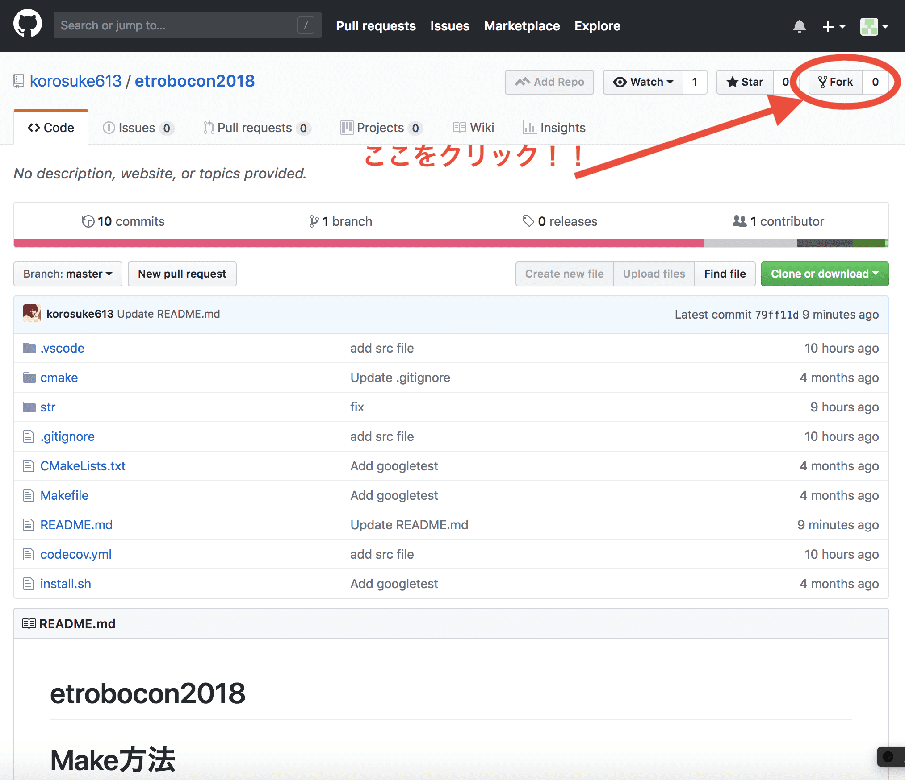
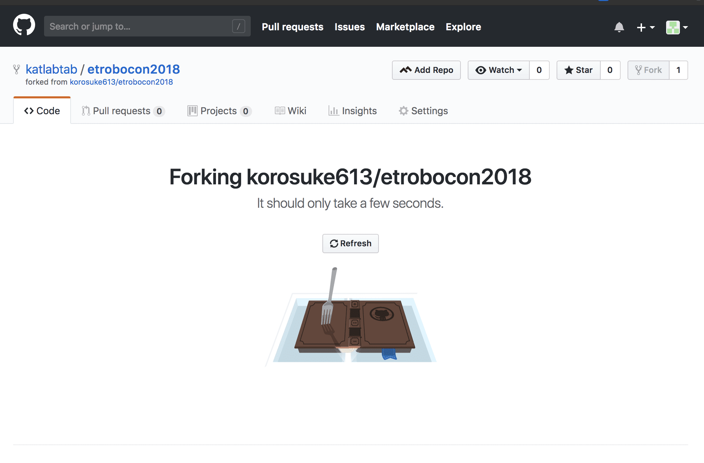
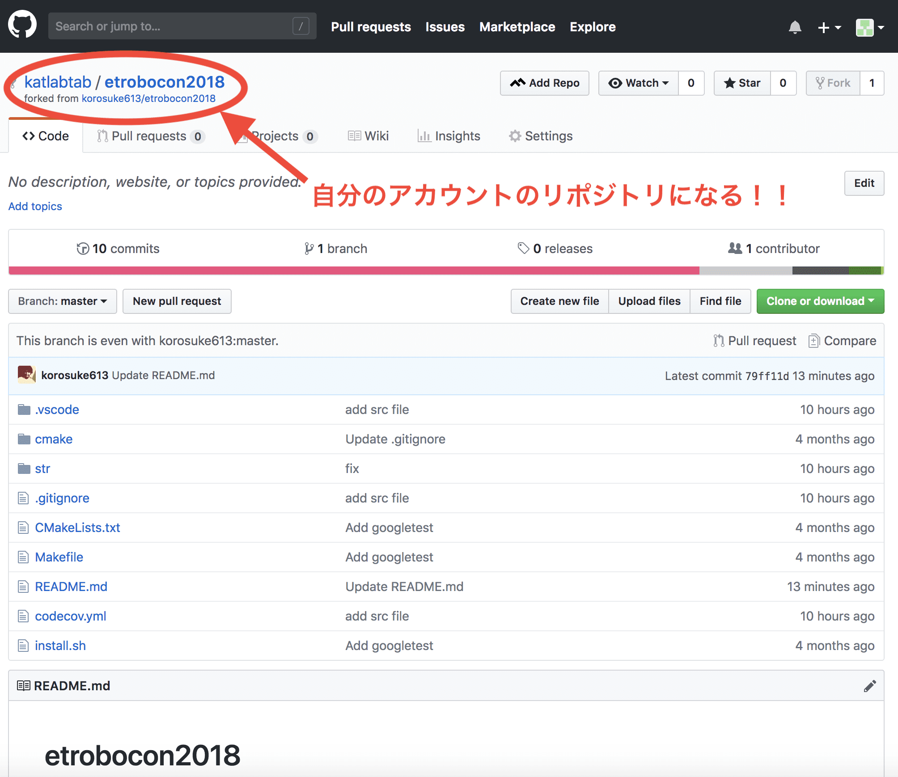
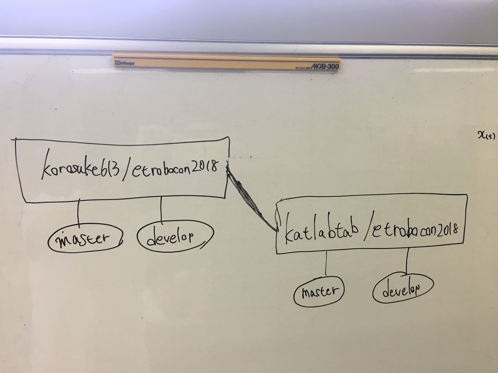
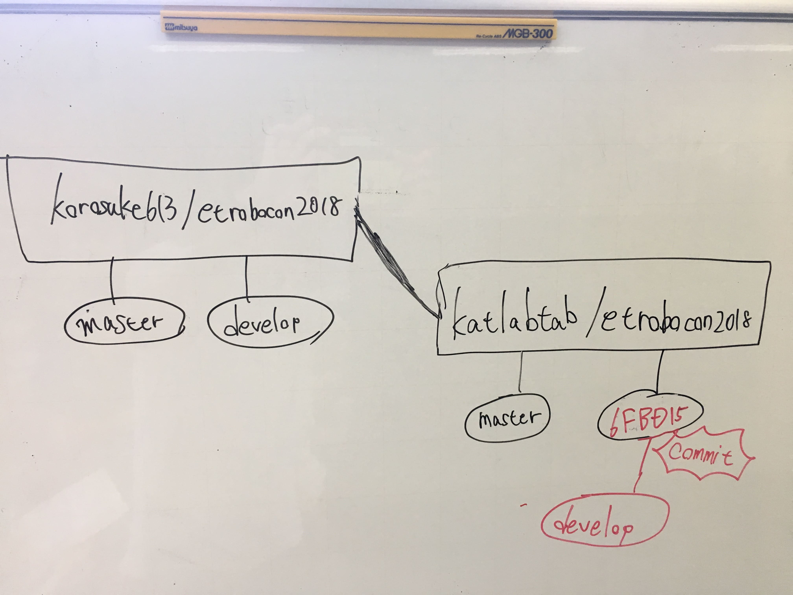
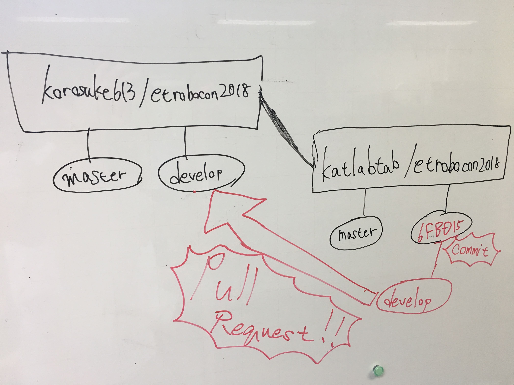
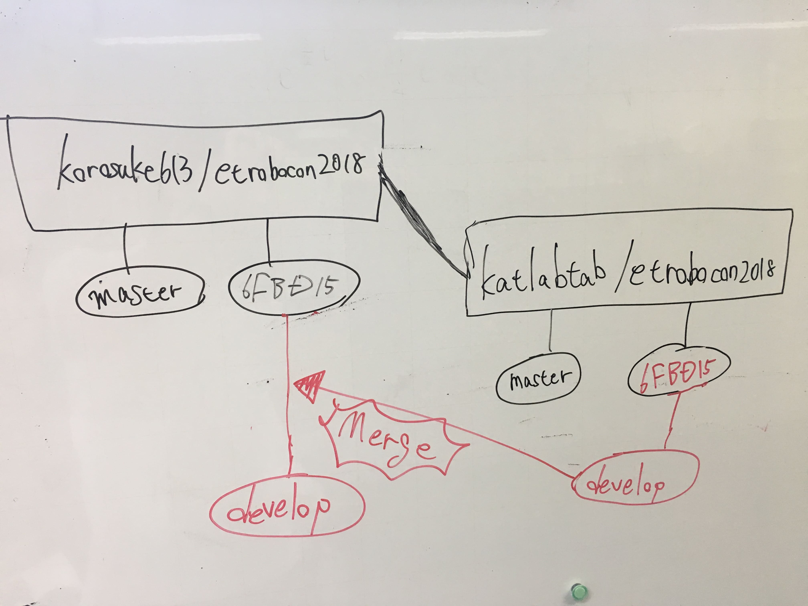

# etrobocon2018

## コミット方法

まず、このリポジトリをForkしましょう。


そしたら、こういった画面になります。数秒待ちましょう。


待つと、このような画面になります。


これでForkはできました。
現在、こういった状況です。(`korosuke613/etrobocon2018`を`katlabtab`がforkした場合)


もし、`katlabtab/etrobocon2018`の`develop`ブランチを更新しても、大元のリポジトリに影響はありません。


この変更を大元のリポジトリに反映させたい場合、`korosuke613/etrobocon2018`の`develop`ブランチにpull requestを行いましょう。


このpull requestが承認されると、大元のリポジトリに変更が反映されます。



## Make方法

`etrobocon2018/`ディレクトリ内で、以下を実行してください。

```bash
cd str
docker run --rm -it -v $PWD:/home/hrp2/sdk/workspace/src korosuke613/etrobo-docker bash
```

すると、`root@dacad950866e:/home/hrp2/sdk/workspace#`見たいなシェルに入ります。

```bash
cd src
./makeSpecial.sh
```

`makeSpecial.sh`を`/home/hrp2/sdk/workspace/src`にて実行すると、同ディレクトリ内に、２つの実行ファイル`app_left`, `app_right`が生成されます。

```bash
root@dacad950866e:/home/hrp2/sdk/workspace/src# ls
Makefile.inc  app.h      apps         makeRight.sh
app.cfg       app_left   ev3-api      makeSpecial.sh
app.cpp       app_right  makeLeft.sh
```

`app_left`が、Lコースの走行プログラムです。

`app_right`がRコースの走行プログラムです。
